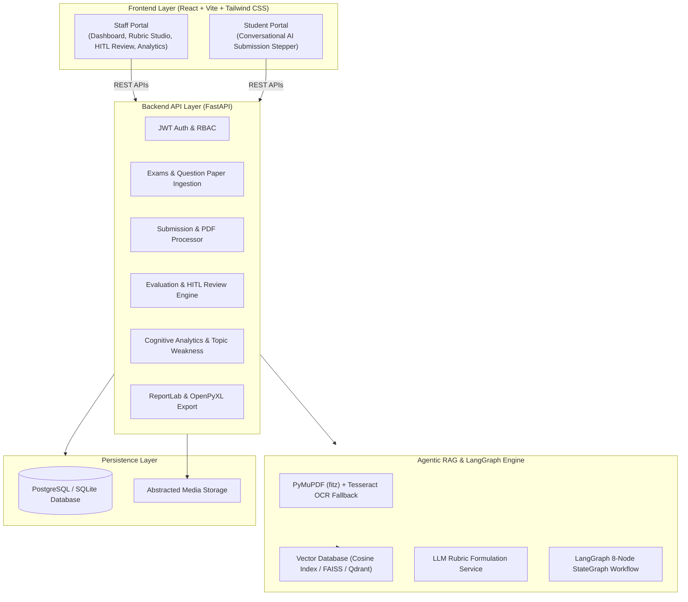
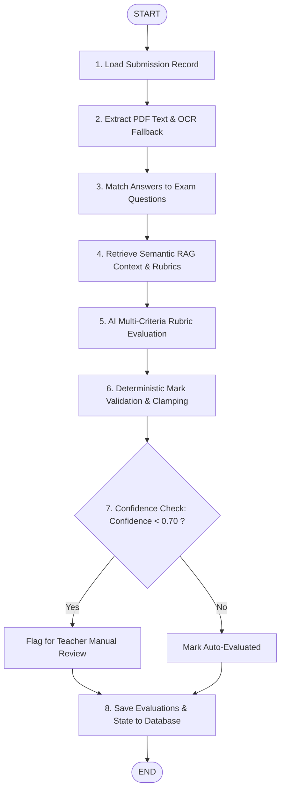

# Evaluation AI 🎓🤖
### Agentic RAG-Based Intelligent Answer Evaluation System

[](https://fastapi.tiangolo.com)
[](https://reactjs.org)
[](https://tailwindcss.com)
[](https://langchain-ai.github.io/langgraph/)
[](#)

**Evaluation AI** is an examination answer-sheet evaluation platform. It streamlines the entire grading lifecycle: from question paper parsing and automated rubric generation, to vector database RAG indexing, OCR answer extraction, deterministic multi-step LangGraph agentic scoring, Human-in-the-Loop (HITL) overrides, and institutional analytics.

---

## 🏛️ System Architecture



---

## 🔄 LangGraph Agentic Evaluation Workflow

The evaluation of student answer sheets follows an 8-node state machine:



---

## ✨ Key Features

1. **Staff Portal & Dashboard**:
   - Live KPI overview: Total Students, Submitted, Evaluated, and Pending Review counts.
   - Question-wise score breakdown, class score distribution histogram, and pass percentage telemetry.
   - Quick-action recent submissions table with immediate review access.

2. **Exam Builder & Automated Question Extraction**:
   - Upload any Question Paper PDF.
   - PyMuPDF and OCR extract 2-mark questions, detect marks, categorize topics, and extract key terms.
   - Automatic LLM formulation of multi-criteria grading rubrics (e.g. 1.0 + 0.5 + 0.5 = 2.0).
   - Interactive Rubric Editor to adjust criteria before publishing.

3. **Semantic RAG Vector Pipeline**:
   - Structured ingestion: `[Question + Rubric Criteria + Expected Answer + Keywords]` mapped into high-dimensional vector embeddings.
   - Accurate cosine similarity retrieval ensuring questions are scored only against their context.

4. **Conversational Student Submission Portal**:
   - Interactive stepped upload flow with live processing animation stepper.
   - Real-time confirmation receipt with register number and status badge.

5. **Human-in-the-Loop (HITL) Review**:
   - Full explainability: AI Score, Confidence score, Detailed Reasoning, Feedback, and Missing Points list.
   - Dual-mark auditability: Teachers can accept AI marks or input a revised mark with teacher commentary.

6. **Institutional Analytics & Weak Topic Detection**:
   - Identifies curriculum areas where class averages fall below benchmark (e.g. *Machine Learning Basics - 58%*).
   - Generates actionable pedagogical recommendations.

7. **One-Click Exporting**:
   - Official PDF Mark Statement via ReportLab with institutional headers.
   - Formatted Excel sheet (`.xlsx`) via OpenPyXL.

---

## 🚀 Getting Started

### 1. Prerequisites
- Python 3.10+
- Node.js 18+ and npm

### 2. Backend Setup
```bash
# Navigate to backend directory
cd backend

# Install dependencies
pip install -r requirements.txt

# Run seed data initialization (Creates demo exam, rubrics, and 5 student submissions)
python -m app.seed_data

# Start FastAPI server
uvicorn app.main:app --host 0.0.0.0 --port 8000 --reload
```
API Documentation will be live at: [http://localhost:8000/docs](http://localhost:8000/docs)

### 3. Frontend Setup
```bash
# Navigate to frontend directory
cd frontend

# Install dependencies
npm install

# Start Vite dev server
npm run dev
```
Web application will be accessible at: [http://localhost:5173](http://localhost:5173)

---

## 🔑 Pre-Seeded Demo Credentials

| Role | Email | Password | Access |
| :--- | :--- | :--- | :--- |
| **Teacher / Staff** | `teacher@edueval.ai` | `password123` | Full Staff Dashboard, Exam Studio, HITL Review, Analytics |
| **Student** | Public Portal | None Required | Answer Sheet PDF Submission & Status Receipt |

---

## 📦 Docker Deployment

To launch the complete multi-container stack with PostgreSQL:
```bash
docker-compose up --build
```
- Frontend: [http://localhost:5173](http://localhost:5173)
- Backend API: [http://localhost:8000](http://localhost:8000)
- PostgreSQL: `localhost:5432`

---

## 🛡️ API Endpoints Summary

| Method | Endpoint | Description | Auth |
| :--- | :--- | :--- | :--- |
| `POST` | `/api/auth/login` | Staff JWT login | Public |
| `POST` | `/api/auth/register` | Register staff account | Public |
| `GET` | `/api/exams` | List all examinations | Staff |
| `GET` | `/api/exams/published` | List published exams | Public (Student) |
| `POST` | `/api/exams` | Create exam | Staff |
| `POST` | `/api/exams/{id}/upload-question-paper` | PDF Upload & Rubric Formulation | Staff |
| `PUT` | `/api/questions/{id}/rubric` | Update question rubric | Staff |
| `POST` | `/api/submissions` | Student answer sheet upload & LangGraph evaluation | Public |
| `GET` | `/api/submissions/{id}` | Get submission details | Public / Staff |
| `PUT` | `/api/evaluations/{id}/teacher-review` | Teacher mark override & comment | Staff |
| `PUT` | `/api/evaluations/submission/{id}/finalize` | Finalize all marks for submission | Staff |
| `GET` | `/api/analytics/dashboard` | Institutional analytics & topic weakness | Staff |
| `GET` | `/api/export/marks/{id}/pdf` | Download official PDF statement | Staff |
| `GET` | `/api/export/marks/{id}/excel` | Download Excel statement | Staff |

---

## 🧪 Testing

Run backend tests:
```bash
pytest tests/test_backend.py
```
